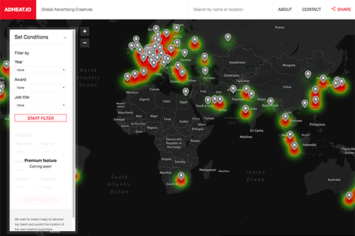
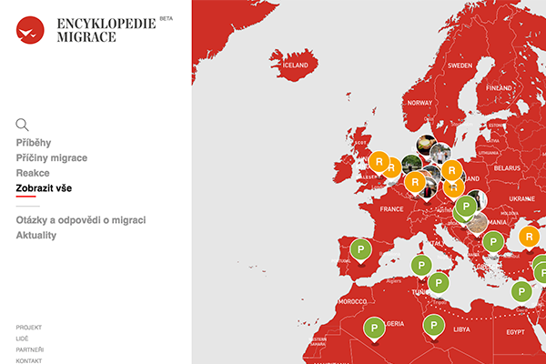

To submit your site to the list, mail us at <a href="mailto:in@sane.ninja">in@sane.ninja</a>

---

## Adheat.io

**Global Advertising Creatives**

In X-Men, Professor Xavier uses Cerebro to detect and locate mutants. Similarly, AdHeat uses heatmap technology to detect and visualize global creative talent and predict the location of the next creative superstars.

Designed from the ground up, AdHeat’s proprietary database aggregates and integrates global advertising award data – from Cannes Lions to the Clios – creating an immersive, game-like interactive experience for users and a unique research tool for advertising and marketing professionals, including: Brands, Agencies, CMOs, Publishers, Consultants and Recruiters.

AdHeat is the brainchild of Champion Muthle.

[Visit Adheat.io](http://adheat.io)

---

## Encyklopedie.org

**Unbiased information source about European Immigration Crisis**

In 2015 a lot of people came to Europe, mostly from the Middle East. They were seeking help and shelter, running away from the horrors of the war and chaos. While some of the Europeans were helping the refugees, most of the population remained indifferent and a little scared. 

The fear of unknown was then used by certain politicians, who promoted the picture of the end of Europe under the resilient Islamic invasion. Their answer is tightening the screws, increasing the power of the police and army and the expulsion of the unwanted strangers. 

As the public debate was moving more to the extreme, we have come up with this idea of an unbiased information source. One that could provide the facts directly from our academic world, using the expert knowledge about the world of today; and transfer this knowledge to the general public in a convenient and comprehensive way. 

To achieve this goal, we are pinning down the facts, events and stories on a map. The map serves as a guide, which enables the user to quickly visualize what is happening and where. 

[Visit Encyklopedie.org](http://encyklopedie.org)